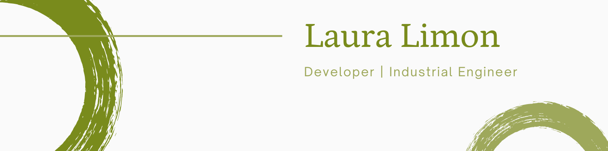

<h1> Hello Fellow < Developers/ >!  </h1>

 Hi! My name is Laura Limon. Thank You for taking the time to view my GitHub Profile :smile: 

<h2> About Me  </h2>

  

- 🌱 I’m currently working at Clapps!

- 🌱 I’m currently learning AWS, Typescript and unit testing.

- 🌱 I’m looking to collaborate on Projects, Tech Articles.

- 🌱 Talk to me about JavaScript, Freelancing Opportunites, Open Source.

  

  
  
  
<h2> Skills  </h2>

<h2> Connect with me  </h2>
 
 

<h2> My GitHub Stats  </h2>

